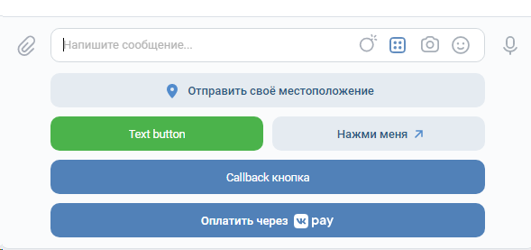
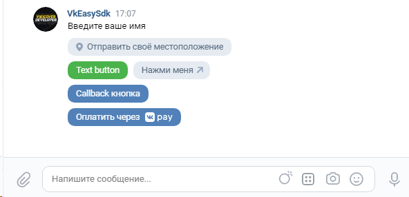

# Callback 
    <?php
    require_once 'vendor\autoload.php';
    
    use VkEasySdk\Methods\Bot;
    use VkEasySdk\VkCallback;

    $callback = new VkCallback('токен бота', 'строка подтверждения');
    
    $callback->event('message_new', function (Bot $bot, object $object, int $group_id) {
        if($bot->rules()->commandRule(['stop', 'start'], ['/', '!'])) {
            $bot->reply('Отреагировал на команду /start или !start ну или /stop !stop');
        } elseif($bot->rules()->attachmentsRule(['photo', 'video'])) {
            $bot->reply('Вы прислали мне фото и|или видео!');
        }
    
        $bot->answer('Привет мир, ты так прекрасен!');
    });
    
    $callback->listener(true);

# Состояния (State)

    class MainState {
        use State;
    
        private array $states = ['name', 'age', 'sex'];
    
        protected function getStates(): array {
            return $this->states;
        }
    }

    $callback = new VkCallback($token, $confirmation, $secret, $group_id);
    
    $callback->event('message_new', function (Bot $bot, $object, $group_id) {
        $state = new MainState($object);
    
        if($bot->rules()->commandRule('start', ['/', '!']) && $state->isCurrent('*')) {
            $bot->answer('Введите ваше имя');
            $state->first();
        } elseif($state->isCurrent('name')) {
            $bot->answer('Введите ваш возраст');
            $state->next($object->message->text);
        } elseif($state->isCurrent('age')) {
            $bot->answer('Введите ваш пол');
            $state->next($object->message->text);
        } else {
            $state->finish($object->message->text);
            $bot->answer('Спасибо '.json_encode($state->getData()));
        }
    });
    
    $callback->listener(true);

# Правила (Rules)
    $bot->rules()->commandRule(['stop', 'start'], ['/', '!']) или $bot->rules()->commandRule('start', ['/', '!'])
    $bot->rules()->attachmentsRule(['photo', 'video']) или $bot->rules()->attachmentsRule('photo')
    $bot->rules()->peerRule()
    $bot->rules()->stickerRule() или $bot->rules()->stickerRule(12719234) 
    $bot->rules()->messageLengthRule(15)
    
# Клавиатура (Keyboard)

    use VkEasySdk\Keyboard\Keyboard;
    use VkEasySdk\Keyboard\Buttons\Color;
    use VkEasySdk\Keyboard\Buttons\CallbackButton;
    use VkEasySdk\Keyboard\Buttons\LinkButton;
    use VkEasySdk\Keyboard\Buttons\LocationButton;
    use VkEasySdk\Keyboard\Buttons\PayButton;
    use VkEasySdk\Keyboard\Buttons\TextButton;

    $keyboard = new Keyboard();
    $k = $keyboard
        ->create(inline: true)
        ->add(new TextButton('Text button', Color::POSITIVE, ['button' => 'one']))
        ->add(new LinkButton('Нажми меня', 'https://github.com/YoppiDev/VkEasySdk', payload: ['button' => 'two']))
        ->row()
        ->add(new CallbackButton('Callback кнопка', Color::PRIMARY, ['callback' => 'done']))
        ->add(new LocationButton(['callback' => 'done']))
        ->add(new PayButton('hash', ['button' => 'pay']))
        ->json();

# DATABASE

**Инициализация**

    $database = new \VkEasySdk\Wrappers\Database();
    $database->connect('mysql', '127.0.0.1', 'root', '', 'test');

**Префикс таблиц**

    $database->setPrefix('myprefix');

В результате sql запрос будет выглядеть так SELECT FROM myprefix_test, DELETE FROM myprefix_test и т.д.

**Выполнение sql запросов**

    $result = $database->query('SELECT * FROM test WHERE id = :id', [
        'id' => 1
    ])->fetch();

или

    $result = $database->query('SELECT * FROM table WHERE id = 5')->fetch();

Функция query возвращает объект PDOStatement

**INSERT**

    $result = $database->multi_insert('test', [
        'name' => 'Лешка', 
        'warnings' => 0,
    ]);

Эквивалентно запросу

    INSERT INTO test (name, warnings) VALUES (?,?)

Вы так же можете при необходимости добавлять сразу множество записей в таблицу

    $result = $database->multiInsert('test', [
        ['name' => 'Лешка', 'warnings' => 0],
        ['name' => 'Васька', 'warnings' => 1],
        ['name' => 'Петька', 'warnings' => 1],
    ]);

**UPDATE**

    $database->update('test', ['name' => "Петро", 'warnings' => 0], ['id' => 8,'name' => "Валентин"]);

Эквивалентно запросу

    UPDATE test SET name=:name, warnings=:warnings WHERE id=:id2 AND name=:name2